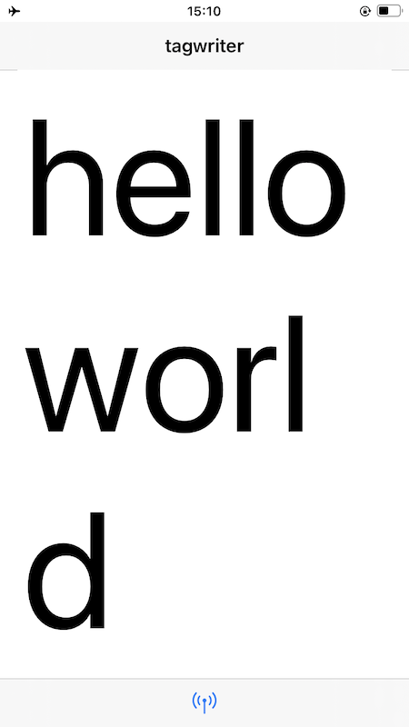
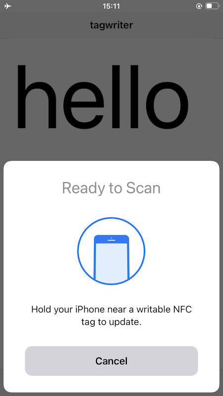
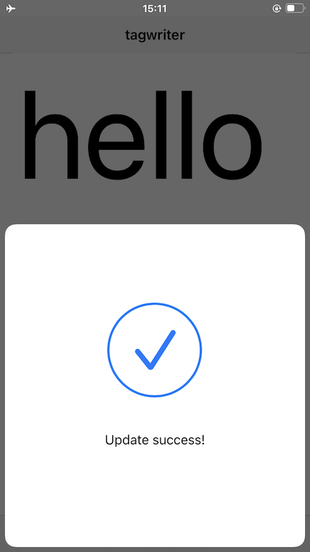

# ios-nfc-tagwriter

Minimalist iOS application for writing NFC tags.

## Important

This is an early stage application and lacks thorough documentation or error handling.

Although there are definitely places where this application can be improved it is meant to be minimalist, by design. It's only purpose is to write atomic NFC tags and to serve a reference implementation for how that functionality works in iOS.

**This application does allow tags to be locked so you should not use this application for deploying NFC tags in a "production" environment.**

## Examples

### Input

### Writing

### Success

## See also

* https://github.com/aaronland/ios-nfc-tagreader